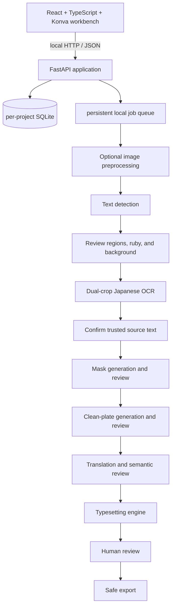

# Manga Localizer

Manga Localizer is a local-first desktop Web workbench for turning Japanese manga screenshots and
scans into reviewed Chinese image exports. It keeps text detection, OCR, reading order, translation,
inpainting, typesetting, review, and export as separate replaceable stages.

> **Release status:** 0.2.0 plus the current Unreleased real-data iteration. The guaranteed baseline
> remains Tesseract + OpenCV/Pillow; optional local PP-OCRv3 and LaMa ONNX providers improve detection
> and restoration when their explicitly installed models are available.


## What works

- Portable SQLite projects with sanitized JSON snapshots, autosave, reopen, and revision history
- Single, multiple, and nested-folder image import with Unicode paths, cumulative original-path
  protection, and immutable source copies
- Dense three-pane workbench with a zoomable canvas and editable numbered text regions
- A persisted image-preprocessing stage with OCR-friendly, balanced, visual-quality, and off profiles;
  2×–4× upscale, denoise, sharpen, contrast, edge, and binarization switches; before/after preview;
  original-coordinate mapping; and per-page profile suggestions that are never auto-applied book-wide
- Offline Tesseract Japanese OCR plus optional PP-OCRv3 polygon detection, including horizontal and
  vertical workflows, low-confidence original-image retry, and actual provider provenance
- Versioned detector/OCR evidence with separate confidence values, provider/input/language provenance,
  OCR attempts retained across reruns, and a fail-closed human trust checkpoint; automatic proposals
  remain reviewable regardless of confidence, while preprocessing changes revoke dependent trust
- Fresh page generations run strict whole-page G6 OCR over both immutable-original and accepted-quality
  crops, require an explicit same-job source selection plus nine-item QC for every non-ruby `translate`
  or `redraw-art` region, and keep queued/running jobs, incomplete pairs, stale checksums, or uncertain
  writes locked
- Manual, deterministic mock, local dictionary, and configurable OpenAI-compatible translation
- Bounded same-page reading-order context, glossary controls, and remote privacy warnings
- Strict G7 page generations keep a server-derived primary/ruby removal map, a checksum-bound mask
  recipe, immutable actual-mask PNG attempts, and a ten-item coverage/collateral review. The operator
  compares original and accepted-quality mask-on/mask-off views; changing the canonical bounded
  brush/eraser recipe makes older attempts stale. The five coverage checks cover body glyphs,
  punctuation, outlines/shadows, linked ruby, and antialias edges; the five collateral checks protect
  bubble borders, characters, speed lines, screentone, and nearby artwork
- New strict G8 uses native cloud image generation directly. Reviewed G5 backgrounds guide the prompt
  and visual checks, not local algorithm selection. LaMa/local AI, deterministic local fills and
  classical fallback production and candidate review are retired; new API requests and old queued
  jobs fail closed with `g8-native-cloud-required`. No local attempt is required before cloud use.
  Candidates still bind accepted quality, G7 mask, raw/provenance, exact PNG/grid and a recomputed
  zero outside-mask change count; cloud success alone is not visual acceptance. Historical local
  artifacts/reviews remain readable and replayable without regeneration. Legacy non-strict pages retain
  text-aware or region masks, safe repair gating, OpenCV fallback, optional local LaMa ONNX restoration,
  and Pillow horizontal or vertical Chinese typesetting with
  vertical punctuation forms, hanging comma/period glyphs, fragment clustering for adjacent small
  boxes, persisted overflow review, and inspector actions to retypeset overflowing or selected boxes
- Persisted accept/reject review for enhanced, repaired, and typeset images; generated-image export
  requires accepted reviews that still match the exact image and repair-mask bytes
- An integrated cross-project **最终验收** view with frozen previews, pending/approved/issues verdicts,
  categorized feedback, repair handoff back to the workbench, revision-safe persistence, and
  terminal all-approved export to a newly selected local directory
- Persistent non-blocking batch jobs with a 1–8 item limit, progress, cooperative controls, failure
  details, and retry; export is serialized for conflict-safe naming
- Safe single/batch export preserving relative folders and emitting original/translated text JSON
- Backend, frontend, and browser-level automated tests using programmatically generated artwork

## Honest limitations

Optional models and ONNX Runtime are not part of the default install, and the application never
downloads them at startup. Pixel mask edits are bounded, ordered strokes attached to one selected
region; arbitrary whole-page raster editing and arbitrary persisted region polygons are not yet
available. PP-OCR/Tesseract can still confuse detailed line art with text, and LaMa
can leave a visible reconstruction band where lettering covers complex line work. The default safe
workflow requires explicit human trust before translation or image repair; confidence never grants
that trust automatically. Human review remains required.

The workbench also does **not** yet provide MangaOCR/PaddleOCR recognition adapters, curve-warp or local
AI-generated art lettering, automatic font matching, reliable speech-bubble classification, PDF/EPUB
import, native installers signed for the App Store, cloud sync, or collaboration. G10 does provide a
bounded deterministic display-font/affine art-lettering route. Local package-time copies of optional
models stay out of git. See the
[real-data iteration report](docs/real-data-iteration-status.md) for measured trade-offs rather than
accuracy claims without ground truth.

## Architecture



Concrete OCR, translation, and inpainting implementations sit behind provider protocols. The UI
never calls a model directly. Project settings are portable; credentials are not.

## Requirements

- Node.js 22.22.2 or newer and npm
- Python 3.12 and [uv](https://docs.astral.sh/uv/)
- Tesseract 5 with Japanese `jpn` and `jpn_vert` language packs
- A current Chromium-based browser is recommended

Apple Silicon and CPU-only systems are supported by the baseline. A GPU is not required.

Optional local providers add these requirements:

- PP-OCRv3 detection: the OpenCV Zoo ONNX model; no additional Python runtime.
- LaMa restoration: `onnxruntime` from the backend `ai` extra plus the OpenCV Zoo LaMa model.
- Real-ESRGAN enhancement: install the optional `ai` extra and the checksum-verified
  `RealESRGAN_x4plus_anime_6B` ONNX model, or a separately installed
  `realesrgan-ncnn-vulkan` executable and its model files. Both adapters report unavailable when
  their runtime or model is absent and never download at startup. Classic Lanczos remains a
  compatibility preprocessor, not an AI upscaler.

### Current verification coverage

| Platform | Current coverage |
| --- | --- |
| macOS on Apple Silicon | Primary local development and browser-testing environment |
| Ubuntu | GitHub Actions workflow configured for backend, frontend, and Chromium E2E checks |
| Windows | Startup instructions provided; no Windows CI job yet |
| Chromium | Automated with Playwright |
| Firefox and Safari | Expected to run the Web UI, but not currently covered by automated browser tests |

## Install and start

The supported local commands assume a managed workstation has already provisioned the canonical
storage-governance guard, its verified external runtime/model/artifact mappings, and the per-user
maintenance installer. Those components deliberately live outside this repository. Without them,
setup and launch fail closed; there is no repository-local heavy-runtime fallback. On that managed
workstation, clone the repository, then run:

```bash
npm install
npm run setup
npm run app
```

On a Mac this starts the local API, serves the built workbench from the same origin, and opens a
dedicated application window when Chrome, Edge, Chromium, or Brave is installed. `npm run app` remains
the developer prototype. To build a double-clickable local `Manga Localizer.app` that starts the API
without a terminal and copies checksum-verified PP-OCR, LaMa, Real-ESRGAN anime, and Argos ja→zh
weights into the bundle:

```bash
npm run package:app
```

That writes the heavy package to the artifact destination returned by the verified guard. It never copies that
heavy bundle to the internal disk. `npm run package:app -- --install-user` instead invokes the
canonical per-user storage-governance maintenance installer, which refreshes the already-managed
thin entry at `~/Applications/Manga Localizer.app` from its hash-bound template; it is not a general
first installer and does not install the package output that was just built. Normal use starts that
thin installed entry, and the storage identity guard then selects the external runtime and model
bundle. A missing or wrong disk fails closed without an internal runtime fallback.
The packaged app binds `127.0.0.1:8000` by default, serves the built frontend from inside the bundle,
and never downloads models at ordinary startup. Missing or checksum-failed bundled files stay
unavailable. The API is not exposed to the network unless you start `npm run app:lan` or launch the
app binary with `--lan`. Import images with **单图** / **多图** / **文件夹**, then run batch
processing as before.

To let an iPhone on the same Wi-Fi import photos while processing stays on the Mac:

```bash
npm run app:lan
```

That binds a private LAN IPv4 (not `0.0.0.0`). The Mac window shows the Safari URL and a **复制地址**
control. On the phone, open that address, then create a local project from **图像**, **画布**, or
**检查** if needed, and import with **多图** or **从相册导入**. macOS
may still block incoming connections until Local Network or firewall access is allowed. `npm run dev`
remains loopback-only.

For browser-only development, `npm run dev` still opens the Vite workbench at
<http://127.0.0.1:5173>. Configuration is optional: copy `.env.example` to `.env` before starting if you
want to change ports, runtime storage, OCR, or remote-translation settings. `scripts/dev.mjs` and
`scripts/app.mjs` load that root `.env` file. The file is Git-ignored.

Below 900px the workbench collapses to **图像 / 画布 / 检查 / 处理** so photo-library import and
processing fit a phone screen. On iPhone Safari, Add to Home Screen uses the local companion icon.

To opt into the checked local ONNX models, run this explicitly before startup:

```bash
npm run setup:ai
```

This installs the backend AI extra and places PP-OCRv3, LaMa, and Real-ESRGAN anime ONNX weights in
the UUID-guarded external model bundle, verifying fixed SHA-256 checksums and printing each model's
license. A missing or wrong external volume fails before the installer runs:

```bash
npm run setup:models -- ppocr lama realesrgan
node scripts/external-uv.mjs sync --extra ai --group dev
```

To opt into local Japanese-to-Chinese translation, install the `mt` extra and both Argos packages.
This is a separate explicit step and does not send text off-machine:

```bash
npm run setup:mt
```

The translation packages use that same guarded external bundle:

```bash
node scripts/external-uv.mjs sync --extra mt --group dev
npm run setup:models -- argos-ja-zh
```

Model installation is always a user-invoked action. Use `npm run setup:models`; the lower-level
Python model tool requires an explicit destination and independently confirms that it is below a
guard-verified external models or artifacts root. The default application and test suite remain
offline and usable with Tesseract/OpenCV/Pillow only.

### macOS

These commands apply after the managed storage-governance prerequisite above has been provisioned:

```bash
brew install node uv tesseract tesseract-lang
npm install
npm run setup
npm run dev
```

### Windows

The governed launcher/runtime route is currently provisioned only on its managed macOS workstation.
Windows source compatibility is retained in application code, but this repository intentionally does
not provide an unmanaged local-runtime fallback or a supported fresh-clone launch recipe.

### Linux (Debian/Ubuntu)

Linux is exercised by GitHub CI with an explicit two-variable CI-local dependency opt-in and a
runner-temporary Python environment. That exception is CI-only. This repository intentionally does
not turn a missing workstation guard into a general Linux local-runtime fallback.

## First project

1. Start the application and choose **New project**.
2. Enter a project/output folder that is different from the source folder, or leave it blank to use
   the local data directory. The Mac application window still uses the in-app file and folder pickers.
3. Import images or a folder. Folder import removes the selected root folder itself and preserves all
   paths beneath it, so selecting `input/` retains `chapter-01/001.png`.
4. Optionally run preprocessing, compare the enhanced image with the original, then detect and OCR.
   A fresh page-generation workflow runs both original and accepted-quality crops for each eligible box.
   When G1 still lacks illustration detail, native G2 reconstruction is available through
   `npm run g2:image -- prepare|import`; see [the G2 workflow](docs/development.md#native-g2-reconstruction).
   It preserves lettering and requires explicit visual acceptance before downstream processing.
5. Review every numbered OCR proposal in the canvas and Text panel. For strict G6 pages, choose the
   trusted attempt or a manual correction and complete all nine QC checks before accepting the page.
   Confidence, including zero, is evidence only and never authorizes translation or default safe repair.
6. On strict pages, save the G7 recipe, generate an immutable actual mask, compare the four
   original/quality mask-on/mask-off views, and record every coverage and collateral check. A rejected
   mask defect that is local to coverage must be revised and regenerated in G7. If review instead exposes
   wrong G4 geometry, paragraph/ruby ownership, or semantic disposition, preserve the rejected generation
   and restart from the immutable source in a fresh generation/workspace before correcting G4; never
   rewrite the accepted upstream history in place.
7. In G8, use the executing Agent's native cloud image tool directly (`image_gen` in Codex), then
   import its immutable result through `cloud:image --mode native`. Compare original, accepted quality,
   the exact accepted mask and candidate; all native-route visual checks and checksum/grid bindings
   must pass. No new LaMa/local/classical candidates or local fallback reviews are allowed. Cloud
   failure remains a blocker, never a silent fallback. G1, OCR, masks, geometric normalization,
   strict compositing, typesetting and exact artifact-free G8 N/A remain available locally.
8. On strict pages, G9 starts only from terminal G8 evidence. Generate one whole-page automatic
   candidate set with a canonical supported provider, or create per-region manual, Agent, or dictionary
   revisions. Review every immutable candidate against all ten translation QC checks; rejected candidates
   remain in history and a later revision must supersede them. Non-ruby `redraw-art` sound effects and
   other art text follow the same trusted-source and semantic-review path as `translate`, then G10 renders
   them through a separate art-lettering route. Only an explicit page-level accepted or not-applicable
   terminal decision completes G9.
9. G10 freezes one whole-page route, region, style, and font contract against the exact G9 terminal and
   accepted clean plate. Bubble and ordinary text use an explicitly checksummed installed CJK font;
   `redraw-art` requires a checksummed display font plus the declared fill/stroke, rotation, non-uniform
   scale, shear, opacity, visual-centre, alignment, and line-spacing capability. `keep-art` and `ignore`
   remain non-rendering routes. Compare immutable original, accepted clean plate, and immutable final
   candidate together, then record all eight visual checks. Acceptance requires zero server-observed
   overflow/anomalies; rejection preserves the candidate and preloads its exact styles for a later retry.
   The legacy render and stage-review paths cannot authorize a strict generation.
10. Legacy pages may still enter Chinese manually or use a configured translation provider, then use the
   combined mask/inpaint control. Confirm or ignore each text region, explicitly accept the
   enhanced/repair/typeset results you will keep, then export. Original files are never replaced.

Default project output resembles:

```text
output/
├── source/chapter-01/001.png
├── generated/
│   ├── preprocessed/chapter-01/001.png
│   ├── lineage-masks/<page-generation-id>/<artifact-id>.png
│   ├── lineage-clean-plates/<page-generation-id>/<candidate-id>.png
│   ├── lineage-typesets/<page-generation-id>/<candidate-id>.png
│   ├── inpainted/chapter-01/001.png
│   ├── typeset/chapter-01/001.png
│   └── masks/chapter-01/001.png  # legacy combined mask/inpaint only
├── translated/chapter-01/001.png
├── original-text/chapter-01/001.json
├── translated-text/chapter-01/001.json
├── masks/chapter-01/001.png
└── project/
    ├── project.json
    └── project.sqlite3
```

Every strict page generation, including a native non-repair generation, must replay its sole creation G0
before artifact work, strict reads, or export. Replay requires a contiguous event sequence, exact actor,
source/target checksums, creation `Revision`, parameter set, run ID, and source references; these checks are
not limited to final-review repair pages. Canonical SQLite triggers `revisions_g0_no_update` and
`revisions_g0_no_delete` make every G0-linked creation Revision append-only, including existing generic
G0 records with their five-key evidence shape; `page_lineage_events_no_update` and
`page_lineage_events_no_delete` do the same for lineage events. The validator still replays exact content,
so an event cannot drift together with its generation, actor, or target. Service replay verifies all four
trigger definitions in `sqlite_master`; any missing, altered, or same-name weakened guard fails closed.
Generic and final-review repair G0 creators run that exact check before any file or database write, returning
a zero-write 4xx instead of publishing 201 and waiting for a later read to discover the missing protection.

Strict G7 authority is the immutable `generated/lineage-masks/<page-generation-id>/<artifact-id>.png`
artifact plus its database checksum and review history. Both `generated/masks/<relative-stem>.png` and
the exported `masks/<relative-stem>.png` are legacy combined-workflow paths and must not be used to
authorize a strict G8 consumer.

Strict G8 authority is the accepted append-only candidate row and
`generated/lineage-clean-plates/<page-generation-id>/<candidate-id>.png`, together with the exact
candidate, route, quality, and accepted-mask checksums plus its seven-result review. The legacy
`generated/inpainted/<relative-path>` output never authorizes a strict active generation, and the
legacy inpaint stage-review endpoint is rejected for every active generation. AI provider aliases are
normalized to their canonical runtime identity before route evidence is frozen.

Strict G9 authority is the append-only region candidate/review history plus one immutable page terminal
review bound to the exact terminal G8 checksum. Model candidates are published by one whole-page job;
manual, Agent, and dictionary changes use the dedicated revision path and never rewrite an earlier
candidate. Acceptance requires all ten QC checks, no computed or reviewer-reported defect, and a current
accepted latest candidate for every eligible non-ruby `translate` or `redraw-art` region. `keep-art`,
`ignore`, and ruby remain outside the translation target set. Only accepted candidates are copied into
the legacy region translation fields; pending and rejected text never becomes a downstream compatibility
projection.

Strict G10 authority is one immutable whole-page candidate and its accepted review, both bound to the
exact terminal G9, clean plate, derived routes, region geometry, checksummed installed fonts, styles,
layouts, raster checksum, and eight visual checks. Bubble/ordinary and art-lettering routes stay
distinct; keep/ignore routes preserve the clean pixels. Legacy render output or stage review cannot
authorize a strict generation.

`source/` is an immutable project-owned copy, never the user's original file. A custom export directory
receives the same reopenable, source-bearing project snapshot; share only `translated/` when recipients
should not receive source artwork. The exported SQLite copy removes machine-only original/project/output
paths, exact import boundaries, and job `outputPath` options, then runs `VACUUM` before publication into
the bundle.

## Final review

Use the top-bar **最终验收** view after project processing is complete. A final-review batch can combine
accepted pages from multiple projects while preserving each page's `(projectId, imageId)` source link.
New batches are strict-only snapshots: every page freezes an immutable original, accepted quality plate,
mask, clean plate, and final image for one artifact revision. A stage can be explicitly not applicable;
only legacy evidence that never existed is shown as unavailable. The comparison tabs use revisioned URLs,
so reopening an older review revision never falls through to a live project artifact. Batch creation locks
every open project store in stable store-root order across strict replay, evidence freezing, database
commit, atomic publication, and the successful 201 response. For every page,
choose **待审核**, **无问题**, or **有问题**. Problem pages support multiple categories such as typesetting,
translation, mask, AI inpainting, preprocessing, missing text, and other, plus a free-form note that is
stored only in the batch database. The backend permits a transition to **无问题** only when the recorded
actor is human; Codex, Cursor, and system actors may report issues or perform repair operations but cannot
approve a final-review item.

**回到工作台修复** creates or reuses an isolated repair page from the immutable source and opens that
page in the workbench. The handoff is bound to the exact review item revision and a checksum of its private
feedback; raw feedback is not copied into public lineage. After the repair page has a newly accepted strict
final result, return to final review and explicitly synchronize it. Synchronization freezes a new artifact
revision, keeps old revisions readable, appends history, and resets the item to pending. Frozen previews
never change merely because a source project changes. Existing format-v1 batches remain readable without
an implicit migration: reviewed legacy items stay locked, while an issue item can enter this repair path
and becomes strict after a successful synchronization. Legacy final evidence exposes only its frozen
revision URL, checksum, and relative path; unavailable grid/resolution and producer/terminal fields remain
honestly null and are validated as that exact v1 shape during conflict recovery.
The client accepts a repair handoff only when it remains in the source project, points to a different
ImageAsset than the immutable source item, and matches the exact default G0 run/parameter contract.
Idempotent reuse additionally requires the request to match the parameter ID/hash already persisted on
that generation, and the response is derived from those stored fields rather than relabeling it with retry
parameters. Lookup first collects every G0 candidate bound to the same item ID, item revision, and feedback
checksum: exactly one may be reused, while multiple matches fail closed. Repair and strict refresh share
one validator that replays the complete generation, unique G0, creation revision, immutable source, repair
target metadata and bytes, decoded grid, physical source/target separation, and contiguous event sequence.
Every strict item that retains a repair handoff replays that validator and confirms the same generation and
image on refresh, even after its verdict becomes pending or approved. G0 and creation `Revision` JSON use
exact field and scalar types; boolean/integer and integer/float lookalikes are not interchangeable. Both
`parameterSetId` and `parameterSetHash` are frozen in that G0/Revision evidence and carried into the
post-refresh handoff; generation-parameter drift blocks retry, refresh, and export even for an approved
item. Strict refresh locks final review before the source project and holds the source lock through artifact
reading, freezing, and the final review CAS, so success cannot describe evidence that was already stale
when returned.

The final-review export action unlocks only after every page is **无问题** and the authoritative batch has
zero pending/problem pages. Choose a new directory that does not already exist; strict review writes and
all repair, synchronization, and export operations use item/batch revision guards plus actor provenance.
Immediately before atomic publication, the application rechecks the all-approved counts, batch revision,
and every frozen artifact/evidence checksum. Name collisions are safely renamed; terminal export never
skips an approved item. OCR/translation text and private feedback are excluded from the exported manifest.
A successful response is accepted only when its resolved output directory matches the requested target and
its manifest is exactly `manifest.json` inside that directory.
A conflicting or unverifiable mutation keeps repair, synchronization, and export locked until a
non-regressing reload proves the exact batch, counts, items, and active item. This workflow is part of
Manga Localizer itself and does not replace the ordinary project workbench or its stage-review database.
Strict response validation recomputes each canonical grid digest and the complete frozen-evidence digest
(excluding only response URLs added after storage), so a syntactically valid but false SHA-256 cannot clear
that lock.
Terminal export likewise locks every open project store in stable store-root order from the initial
currentness check through copying and atomic publication, with a final currentness recheck before rename.
This covers cross-project upstream sources as well as the directly referenced project, so a newly accepted
artifact cannot race into a stale final export.

## OCR providers

Tesseract remains the default detector and recognizer because it starts without Python model downloads
and has maintained cross-platform packages. Install Japanese horizontal and vertical data and check
provider health in Project Settings.

Strict page-lineage OCR accepts only a canonical local provider and a Japanese source-language
declaration. It records the provider-observed model version rather than trusting a client label, binds
each crop to the immutable original or accepted quality checksum, and preserves every rerun as
append-only evidence. A failed run can be retried, but source review and G6 acceptance wait until no OCR
item is queued or running.

`ppocr-v3` is an optional, local detection-only provider using OpenCV DNN and the official OpenCV Zoo
PP-OCRv3 ONNX model. It returns polygon geometry; Tesseract then recognizes each detected region.
`ppocr-v3+tesseract` merges overlapping and nearby aligned candidates from both detectors, then pads
the box so the text is enclosed. Low-confidence text is not dropped. A completed zero-detection page
remains a valid empty result and is not silently re-detected by another provider. MangaOCR and
PaddleOCR recognition adapters remain roadmap work. See
[Provider system](docs/provider-system.md).

## Image preprocessing

`opencv-pillow` is always available and persists a separate enhanced PNG; source files are immutable.
The OCR-friendly profile upscales, denoises, sharpens, and raises contrast. Edge enhancement is
deliberately opt-in: on the private real-data set it amplified line-art false positives. Every switch
can be overridden per project, and detection/OCR coordinates are mapped back to the original image.
Each imported page also gets a local profile suggestion from its size and a sharpness/contrast sample.
That hint can be applied to the current page or adopted as the project default; it is never auto-applied
across the book. Very low-resolution scans can also be sent through a manual **AI 重绘本页** action that
runs local Real-ESRGAN anime 4× on the current page only.

`realesrgan-onnx` is the runnable local AI upscaler. It uses ONNX Runtime and the BSD-3-Clause
`RealESRGAN_x4plus_anime_6B` graph, tiled on large pages. The model is native 4×; 2×/3× requests
downscale that AI result with Lanczos and are labeled as such. Effectively grayscale sources stay
grayscale so the RGB model cannot introduce chroma. Classic `opencv-pillow` Lanczos remains
available and is never reported as AI upscaling.

`realesrgan-ncnn` remains an optional adapter around a local Real-ESRGAN NCNN executable. It searches
`PATH` and the application data directory, passes a sibling `models/` folder to the CLI, preserves
alpha, can chain local post-processing, and reports unavailable when the executable is absent. Neither
adapter downloads weights at startup.

## Background restoration

`opencv` provides Telea, Navier-Stokes, and solid fill as the guaranteed fallback. `lama-onnx` is the
optional AI provider and runs the OpenCV Zoo 512×512 model locally through ONNX Runtime. It performs
context-cropped inference and composites only inside the mask, preserving every zero-mask pixel.

The default `safe` repair policy repairs only regions with a current explicit human trust decision.
Automatic proposals remain pending even at high confidence. Use `recognized` or `all` only as deliberate
high-risk review/testing overrides; plates created by those overrides are not reused by a later `safe`
typesetting run. AI restoration is
materially better than whole-page rectangular OpenCV repair on tested complex pages, but it cannot
reconstruct line work hidden entirely by the original glyphs and may still need an external editor.

## Translation providers

- **Manual:** performs no automatic translation and preserves user input.
- **Mock:** deterministic output for tests and demonstrations.
- **Dictionary:** applies a local exact-match glossary without a language model.
- **OpenAI-compatible:** uses a configurable base URL, model, and process/session API key.

For a strict active generation, manual and dictionary providers are revision-only and cannot create an
automatic translation job. Automatic jobs freeze the server-observed canonical provider/model and
bounded context policy before insertion; supported local identities are mock and Argos
Japanese-to-Chinese, while OpenAI-compatible use requires explicit per-job remote authorization and a
valid configured credential. The worker rechecks the frozen identity before any provider call.

Copy `.env.example` to `.env` for process configuration, or enter an API key in Project Settings for
the current backend session only. Never paste a production credential into a project manifest. Each
remote request contains one explicitly trusted current text, a bounded number of explicitly trusted
preceding/following text regions by reading order on the same page, optional character names/glossary,
and no image bytes or whole-book context.

Use HTTPS for every non-loopback endpoint. Plain HTTP is appropriate only for a trusted service bound
to loopback, because the configured API key is sent to that endpoint as a Bearer credential. Endpoint
validation rejects embedded credentials, query strings, fragments, and non-loopback HTTP. Changing the
remote endpoint or model invalidates translation, typesetting, and export results so stale output cannot
be treated as current.

## Privacy and source safety

Everything is local by default. Images are not uploaded by the application. Only selecting and
configuring a remote translation provider enables outbound text requests, and the UI displays this
risk before use. API keys are redacted and excluded from SQLite, project JSON, and logs. Imports are
treated as read-only; every export target is checked against recorded originals, and edits invalidate
stale rendered output before preview/export. Export paths are validated and conflict-safe. Read [Privacy](docs/privacy.md)
and [Security](SECURITY.md) before enabling remote services.

## Reliability and recovery

- Trusted local selections are recorded cumulatively as exact file/directory `ImportBoundary` rows
  before image decoding. A candidate that later fails validation remains protected from export writes.
  `inputRoot` is only a convenience summary and can be empty when selections have no usable common path,
  including cross-drive Windows imports.
- Portable path conflicts use component-wise Unicode NFKC plus case-folded comparison. Imports and
  exports therefore rename or reject names that would collide on a case-insensitive or
  normalization-insensitive filesystem.
- Project and region writes carry revision guards. Autosave rebases newer local edits and project
  settings onto acknowledged server revisions; an unresolved concurrent conflict is surfaced instead of
  silently overwriting another edit.
- Visual-stage reviews are revision guarded and persist SHA-256 values calculated from the exact bytes
  decoded in the review canvas; inpaint review also loads and visibly presents its mask. Upstream
  rejection, withdrawal, regeneration, or changed bytes clears or blocks dependent acceptance.
  JSON-only export is exempt, while generated-image export requires accepted, checksum-current inpaint
  and, when applicable, typeset results.
- Pause/cancel is cooperative: active items may finish, queued items stop, and persisted running work is
  recovered after restart. An interrupted cancelled item remains cancelled and can be retried explicitly.
- Export files and the portable manifest/database pair use atomic replacement. A job-scoped owner marker
  permits recovery of only that job's partial bundle, including SQLite temporary sidecars. An export job
  remains nonterminal until bundle finalization succeeds.
- Portable bundles retain every G7 mask, G8 clean plate, and G10 typeset raster referenced by the
  retained database, plus only catalog-validated public font capability tokens. Credential-like values
  remain scrubbed, and one project writer lock spans asset discovery, copy, verification, and SQLite
  backup so the files and database describe the same snapshot.
- A relative custom export path is resolved and persisted against the project root before work starts,
  not against a later process working directory.

## Development and tests

```bash
npm run dev                 # API + Vite with reload
npm run check               # launcher + backend + frontend gates
npm run test:e2e            # full browser flow
npm run audit:release       # secrets, personal paths, weights, fonts, DBs, large files
```

Run `npm run setup:test` once before the first Playwright run. Backend-only and frontend-only
commands are documented in [Development](docs/development.md).

The prior Round 7 candidate was verified on 2026-08-12:

- `npm run check`: 2 launcher tests, Ruff lint/format, 130 backend pytest cases, ESLint, TypeScript,
  64 frontend Vitest cases, and the production Vite build
- Playwright: 2 Chromium journeys, including preprocessing, real local detection/OCR, actual mask
  preview, repair, typesetting, export, and project reopen
- Private real-data regression: all 130 supplied images completed the comparison runs; the exact final
  three-image PP-OCRv3/LaMa pipeline completed 21/21 stage items with unchanged sources/dimensions and
  zero changed pixels outside generated masks
- Release/privacy audit: real inputs, outputs, OCR content, model weights, project databases, and
  machine-specific paths remain excluded from the tracked tree

Coverage counts and OCR confidence are not accuracy claims because the supplied set has no annotated
box/transcription ground truth. See [Real-data iteration status](docs/real-data-iteration-status.md) for
the measured tradeoffs, visual findings, and remaining roadmap.

The post-Round-9 OCR trust/disposition checkpoint is delivered on the non-default draft PR branch at
`29305788cfbb8f4d1f36354ba89c40e18d15400e`. GitHub CI run `31729184780` passed Ruff lint/format,
184 backend tests, the release/privacy audit, frontend lint/typecheck/build with 92 tests, and both
Playwright journeys. This verifies the safety and workflow contract; private real-data calibration is
still required before making recognition-accuracy or unattended-publication claims.

The 0.2.0 source tree was verified on 2026-08-06:

- `npm run check`: 2 launcher tests, Ruff lint/format plus 78 backend pytest cases, and ESLint,
  TypeScript, 39 frontend Vitest cases, and the production Vite build
- Playwright: 2 Chromium scenarios, including the real local Tesseract workflow
- Dependency audits: 0 known vulnerabilities in both npm dependency trees and from
  `pip-audit`
- Release audit: 94 candidate files plus Git history scanned with 0 findings
- `npm run dev`: root page, direct API health, and the Vite `/api` proxy were exercised successfully

## Repository layout

```text
backend/        FastAPI application, providers, storage, workers, and pytest suite
frontend/       React workbench and Vitest suite
tests/e2e/      Playwright user journeys
scripts/        fixture generation and release audit
docs/           architecture, model, provider, privacy, and contributor documentation
.github/        CI, issue forms, and pull-request template
```

## FAQ

### Does OCR also translate?

No. Detection, OCR, reading order, and translation are explicit separate stages.

### Why is the repaired background imperfect?

OpenCV only interpolates nearby pixels, while LaMa predicts plausible local content; neither can know
the line art that was fully hidden by a glyph. Inspect the mask overlay, adjust the region and
padding/dilation/feathering, switch between text and full-region masks, refine the selected region with
the mask brush/eraser, and keep difficult textures for manual review.

### Can I use a commercial font?

Configure a font you are licensed to use. This repository does not ship fonts.

### Where are my projects?

The output root you chose contains the portable database and JSON manifest. If you leave it blank,
projects are created below the required `MANGA_LOCALIZER_DATA_DIR/projects/`. Guarded launchers inject
that value from `mappings.manga_localizer.app_data_root`; there is no repository-relative or home-directory
fallback. A catalog there remembers recent project
manifests. The JSON snapshot is inspectable, but reopening still requires the adjacent SQLite database.

### The OCR health check fails

Run `tesseract --version` and `tesseract --list-langs`, confirm `jpn` is present, and see
[Troubleshooting](docs/troubleshooting.md).

## Contributing

Issues and pull requests are welcome. Start with [CONTRIBUTING.md](CONTRIBUTING.md), follow the
[Code of Conduct](CODE_OF_CONDUCT.md), and avoid attaching copyrighted manga pages to public issues.
The project is licensed under [Apache-2.0](LICENSE). Dependency licensing is summarized in
[Third-party notices](THIRD_PARTY_NOTICES.md).
