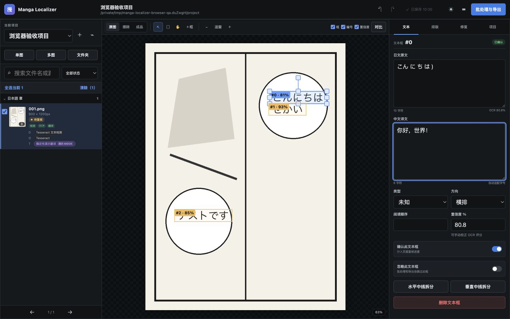
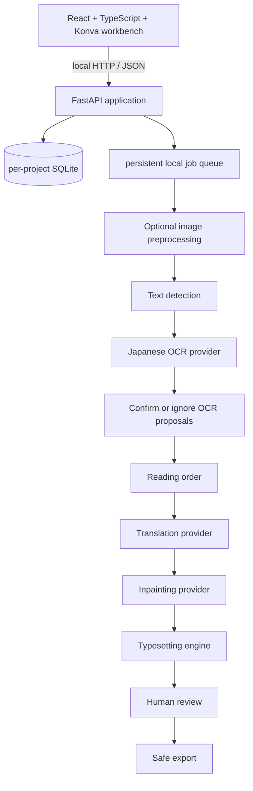

# Manga Localizer

Manga Localizer is a local-first desktop Web workbench for turning Japanese manga screenshots and
scans into reviewed Chinese image exports. It keeps text detection, OCR, reading order, translation,
inpainting, typesetting, review, and export as separate replaceable stages.

> **Release status:** 0.2.0 plus the current Unreleased real-data iteration. The guaranteed baseline
> remains Tesseract + OpenCV/Pillow; optional local PP-OCRv3 and LaMa ONNX providers improve detection
> and restoration when their explicitly installed models are available.



## What works

- Portable SQLite projects with sanitized JSON snapshots, autosave, reopen, and revision history
- Single, multiple, and nested-folder image import with Unicode paths, cumulative original-path
  protection, and immutable source copies
- Dense three-pane workbench with a zoomable canvas and editable numbered text regions
- A persisted image-preprocessing stage with OCR-friendly, balanced, visual-quality, and off profiles;
  2×–4× upscale, denoise, sharpen, contrast, edge, and binarization switches; before/after preview;
  and original-coordinate mapping
- Offline Tesseract Japanese OCR plus optional PP-OCRv3 polygon detection, including horizontal and
  vertical workflows, low-confidence original-image retry, and actual provider provenance
- Versioned detector/OCR evidence with separate confidence values, provider/input/language provenance,
  OCR attempts retained across reruns, and a fail-closed human trust checkpoint; automatic proposals
  remain reviewable regardless of confidence, while preprocessing changes revoke dependent trust
- Manual, deterministic mock, local dictionary, and configurable OpenAI-compatible translation
- Bounded same-page reading-order context, glossary controls, and remote privacy warnings
- Text-aware or region masks with padding, dilation, feathering, a visible mask overlay, editable
  region boundaries, persisted per-region brush/eraser strokes, safe repair gating, OpenCV fallback,
  optional local LaMa ONNX restoration, and Pillow horizontal or vertical Chinese typesetting
- Persisted accept/reject review for enhanced, repaired, and typeset images; generated-image export
  requires accepted reviews that still match the exact image and repair-mask bytes
- Persistent non-blocking batch jobs with a 1–8 item limit, progress, cooperative controls, failure
  details, and retry; export is serialized for conflict-safe naming
- Safe single/batch export preserving relative folders and emitting original/translated text JSON
- Backend, frontend, and browser-level automated tests using programmatically generated artwork

## Honest limitations

Optional models and ONNX Runtime are not part of the default install, and the application never
downloads them at startup. Pixel mask edits are bounded, ordered strokes attached to one selected
region; arbitrary whole-page raster editing and arbitrary persisted region polygons are not yet
available. PP-OCR/Tesseract can still confuse detailed line art with text, and LaMa
can leave a visible reconstruction band where lettering covers complex line work. The default safe
workflow requires explicit human trust before translation or image repair; confidence never grants
that trust automatically. Human review remains required.

The workbench also does **not** yet provide MangaOCR/PaddleOCR recognition adapters, artistic
sound-effect redraw, automatic font matching, reliable speech-bubble classification, PDF/EPUB import,
native installers, cloud sync, or collaboration. No model weights or fonts are bundled. See the
[real-data iteration report](docs/real-data-iteration-status.md) for measured trade-offs rather than
accuracy claims without ground truth.

## Architecture



Concrete OCR, translation, and inpainting implementations sit behind provider protocols. The UI
never calls a model directly. Project settings are portable; credentials are not.

## Requirements

- Node.js 22.22.2 or newer and npm
- Python 3.12 and [uv](https://docs.astral.sh/uv/)
- Tesseract 5 with Japanese `jpn` and `jpn_vert` language packs
- A current Chromium-based browser is recommended

Apple Silicon and CPU-only systems are supported by the baseline. A GPU is not required.

Optional local providers add these requirements:

- PP-OCRv3 detection: the OpenCV Zoo ONNX model; no additional Python runtime.
- LaMa restoration: `onnxruntime` from the backend `ai` extra plus the OpenCV Zoo LaMa model.
- Real-ESRGAN enhancement: a separately installed `realesrgan-ncnn-vulkan` executable and its model
  files. The adapter reports unavailable when the executable is absent and never blocks startup.

### Current verification coverage

| Platform | Current coverage |
| --- | --- |
| macOS on Apple Silicon | Primary local development and browser-testing environment |
| Ubuntu | GitHub Actions workflow configured for backend, frontend, and Chromium E2E checks |
| Windows | Startup instructions provided; no Windows CI job yet |
| Chromium | Automated with Playwright |
| Firefox and Safari | Expected to run the Web UI, but not currently covered by automated browser tests |

## Install and start

Clone the repository, then run:

```bash
npm install
npm run setup
npm run dev
```

Open <http://127.0.0.1:5173>. The local API listens on `127.0.0.1:8000`; it is not exposed to the
network by default. Configuration is optional: copy `.env.example` to `.env` before starting if you
want to change ports, runtime storage, OCR, or remote-translation settings. `scripts/dev.mjs` loads
that root `.env` file and passes the values to both development processes. The file is Git-ignored.

To opt into both checked local ONNX models, run this explicitly before startup:

```bash
npm run setup:ai
```

This installs the backend AI extra and downloads PP-OCRv3 plus LaMa into
`~/.manga-localizer/models/`, verifying fixed SHA-256 checksums. If your `.env` changes
`MANGA_LOCALIZER_DATA_DIR`, point the model setup at the same directory instead:

```bash
npm run setup:models -- --data-dir .manga-localizer ppocr lama
uv sync --project backend --extra ai --group dev
```

Model installation is always a user-invoked action. The default application and test suite remain
offline and usable with Tesseract/OpenCV/Pillow only.

### macOS

```bash
brew install node uv tesseract tesseract-lang
npm install
npm run setup
npm run dev
```

### Windows

Install Node.js 22.22.2 or newer, uv, and a current Tesseract build containing Japanese trained data. Ensure
`tesseract.exe` is on `PATH`, then use PowerShell:

```powershell
npm install
npm run setup
npm run dev
```

If Tesseract is elsewhere, set `MANGA_LOCALIZER_TESSERACT_COMMAND` to its full executable path in
your local `.env`.

### Linux (Debian/Ubuntu)

```bash
# Install Node.js 22.22.2+ with its official installer or a version manager first.
sudo apt-get update
sudo apt-get install -y fonts-noto-cjk tesseract-ocr tesseract-ocr-jpn tesseract-ocr-jpn-vert
curl -LsSf https://astral.sh/uv/install.sh | sh
npm install
npm run setup
npm run dev
```

Package names differ between distributions; verify `tesseract --list-langs` contains both `jpn` and
`jpn_vert`. Distribution-provided Node.js packages may be older than this project's requirement.

## First project

1. Start the application and choose **New project**.
2. Enter a project/output folder that is different from the source folder, or leave it blank to use
   the local data directory. Native directory pickers are deferred to desktop packaging.
3. Import images or a folder. Folder import removes the selected root folder itself and preserves all
   paths beneath it, so selecting `input/` retains `chapter-01/001.png`.
4. Optionally run preprocessing, compare the enhanced image with the original, then detect and OCR.
5. Review every numbered OCR proposal in the canvas and Text panel, then explicitly confirm or ignore
   it. Confidence is evidence only and never authorizes translation or default safe repair.
6. Enter Chinese manually or choose a configured translation provider. Only trusted text and trusted
   bounded same-page context reach a translator. Automatic translation that changes the translated text
   clears the current content confirmation, so inspect the result and confirm the region again before
   completing page review.
7. Inspect the real mask overlay, choose text/full-region masking and an available inpainter, adjust
   the selected region with the mask brush/eraser, then rerun repair and typesetting as needed.
8. Confirm or ignore each text region, explicitly accept the enhanced/repair/typeset results you will
   keep, then export. Original files are never replaced.

Default project output resembles:

```text
output/
├── source/chapter-01/001.png
├── generated/
│   ├── preprocessed/chapter-01/001.png
│   ├── inpainted/chapter-01/001.png
│   ├── typeset/chapter-01/001.png
│   └── masks/chapter-01/001.png
├── translated/chapter-01/001.png
├── original-text/chapter-01/001.json
├── translated-text/chapter-01/001.json
├── masks/chapter-01/001.png
└── project/
    ├── project.json
    └── project.sqlite3
```

`source/` is an immutable project-owned copy, never the user's original file. A custom export directory
receives the same reopenable, source-bearing project snapshot; share only `translated/` when recipients
should not receive source artwork. The exported SQLite copy removes machine-only original/project/output
paths, exact import boundaries, and job `outputPath` options, then runs `VACUUM` before publication into
the bundle.

## OCR providers

Tesseract remains the default detector and recognizer because it starts without Python model downloads
and has maintained cross-platform packages. Install Japanese horizontal and vertical data and check
provider health in Project Settings.

`ppocr-v3` is an optional, local detection-only provider using OpenCV DNN and the official OpenCV Zoo
PP-OCRv3 ONNX model. It returns polygon geometry; Tesseract then recognizes each detected region. A
completed zero-detection page remains a valid empty result and is not silently re-detected by another
provider. MangaOCR and PaddleOCR recognition adapters remain roadmap work. See
[Provider system](docs/provider-system.md).

## Image preprocessing

`opencv-pillow` is always available and persists a separate enhanced PNG; source files are immutable.
The OCR-friendly profile upscales, denoises, sharpens, and raises contrast. Edge enhancement is
deliberately opt-in: on the private real-data set it amplified line-art false positives. Every switch
can be overridden per project, and detection/OCR coordinates are mapped back to the original image.

`realesrgan-ncnn` is an optional adapter around a local Real-ESRGAN NCNN executable. It uses temporary
files, preserves alpha, can chain the local post-processing switches, and reports a clear unavailable
health state when the executable is not installed. It does not download an executable or weights.

## Background restoration

`opencv` provides Telea, Navier-Stokes, and solid fill as the guaranteed fallback. `lama-onnx` is the
optional AI provider and runs the OpenCV Zoo 512×512 model locally through ONNX Runtime. It performs
context-cropped inference and composites only inside the mask, preserving every zero-mask pixel.

The default `safe` repair policy repairs only regions with a current explicit human trust decision.
Automatic proposals remain pending even at high confidence. Use `recognized` or `all` only as deliberate
high-risk review/testing overrides; plates created by those overrides are not reused by a later `safe`
typesetting run. AI restoration is
materially better than whole-page rectangular OpenCV repair on tested complex pages, but it cannot
reconstruct line work hidden entirely by the original glyphs and may still need an external editor.

## Translation providers

- **Manual:** performs no automatic translation and preserves user input.
- **Mock:** deterministic output for tests and demonstrations.
- **Dictionary:** applies a local exact-match glossary without a language model.
- **OpenAI-compatible:** uses a configurable base URL, model, and process/session API key.

Copy `.env.example` to `.env` for process configuration, or enter an API key in Project Settings for
the current backend session only. Never paste a production credential into a project manifest. Each
remote request contains one explicitly trusted current text, a bounded number of explicitly trusted
preceding/following text regions by reading order on the same page, optional character names/glossary,
and no image bytes or whole-book context.

Use HTTPS for every non-loopback endpoint. Plain HTTP is appropriate only for a trusted service bound
to loopback, because the configured API key is sent to that endpoint as a Bearer credential. Endpoint
validation rejects embedded credentials, query strings, fragments, and non-loopback HTTP. Changing the
remote endpoint or model invalidates translation, typesetting, and export results so stale output cannot
be treated as current.

## Privacy and source safety

Everything is local by default. Images are not uploaded by the application. Only selecting and
configuring a remote translation provider enables outbound text requests, and the UI displays this
risk before use. API keys are redacted and excluded from SQLite, project JSON, and logs. Imports are
treated as read-only; every export target is checked against recorded originals, and edits invalidate
stale rendered output before preview/export. Export paths are validated and conflict-safe. Read [Privacy](docs/privacy.md)
and [Security](SECURITY.md) before enabling remote services.

## Reliability and recovery

- Trusted local selections are recorded cumulatively as exact file/directory `ImportBoundary` rows
  before image decoding. A candidate that later fails validation remains protected from export writes.
  `inputRoot` is only a convenience summary and can be empty when selections have no usable common path,
  including cross-drive Windows imports.
- Portable path conflicts use component-wise Unicode NFKC plus case-folded comparison. Imports and
  exports therefore rename or reject names that would collide on a case-insensitive or
  normalization-insensitive filesystem.
- Project and region writes carry revision guards. Autosave rebases newer local edits and project
  settings onto acknowledged server revisions; an unresolved concurrent conflict is surfaced instead of
  silently overwriting another edit.
- Visual-stage reviews are revision guarded and persist SHA-256 values calculated from the exact bytes
  decoded in the review canvas; inpaint review also loads and visibly presents its mask. Upstream
  rejection, withdrawal, regeneration, or changed bytes clears or blocks dependent acceptance.
  JSON-only export is exempt, while generated-image export requires accepted, checksum-current inpaint
  and, when applicable, typeset results.
- Pause/cancel is cooperative: active items may finish, queued items stop, and persisted running work is
  recovered after restart. An interrupted cancelled item remains cancelled and can be retried explicitly.
- Export files and the portable manifest/database pair use atomic replacement. A job-scoped owner marker
  permits recovery of only that job's partial bundle, including SQLite temporary sidecars. An export job
  remains nonterminal until bundle finalization succeeds.
- A relative custom export path is resolved and persisted against the project root before work starts,
  not against a later process working directory.

## Development and tests

```bash
npm run dev                 # API + Vite with reload
npm run check               # launcher + backend + frontend gates
npm run test:e2e            # full browser flow
npm run audit:release       # secrets, personal paths, weights, fonts, DBs, large files
```

Run `npm run setup:test` once before the first Playwright run. Backend-only and frontend-only
commands are documented in [Development](docs/development.md).

The prior Round 7 candidate was verified on 2026-08-12:

- `npm run check`: 2 launcher tests, Ruff lint/format, 130 backend pytest cases, ESLint, TypeScript,
  64 frontend Vitest cases, and the production Vite build
- Playwright: 2 Chromium journeys, including preprocessing, real local detection/OCR, actual mask
  preview, repair, typesetting, export, and project reopen
- Private real-data regression: all 130 supplied images completed the comparison runs; the exact final
  three-image PP-OCRv3/LaMa pipeline completed 21/21 stage items with unchanged sources/dimensions and
  zero changed pixels outside generated masks
- Release/privacy audit: real inputs, outputs, OCR content, model weights, project databases, and
  machine-specific paths remain excluded from the tracked tree

Coverage counts and OCR confidence are not accuracy claims because the supplied set has no annotated
box/transcription ground truth. See [Real-data iteration status](docs/real-data-iteration-status.md) for
the measured tradeoffs, visual findings, and remaining roadmap.

The post-Round-9 OCR trust/disposition checkpoint is delivered on the non-default draft PR branch at
`29305788cfbb8f4d1f36354ba89c40e18d15400e`. GitHub CI run `31729184780` passed Ruff lint/format,
184 backend tests, the release/privacy audit, frontend lint/typecheck/build with 92 tests, and both
Playwright journeys. This verifies the safety and workflow contract; private real-data calibration is
still required before making recognition-accuracy or unattended-publication claims.

The 0.2.0 source tree was verified on 2026-08-06:

- `npm run check`: 2 launcher tests, Ruff lint/format plus 78 backend pytest cases, and ESLint,
  TypeScript, 39 frontend Vitest cases, and the production Vite build
- Playwright: 2 Chromium scenarios, including the real local Tesseract workflow
- Dependency audits: 0 known vulnerabilities in both npm dependency trees and from
  `pip-audit`
- Release audit: 94 candidate files plus Git history scanned with 0 findings
- `npm run dev`: root page, direct API health, and the Vite `/api` proxy were exercised successfully

## Repository layout

```text
backend/        FastAPI application, providers, storage, workers, and pytest suite
frontend/       React workbench and Vitest suite
tests/e2e/      Playwright user journeys
scripts/        fixture generation and release audit
docs/           architecture, model, provider, privacy, and contributor documentation
.github/        CI, issue forms, and pull-request template
```

## FAQ

### Does OCR also translate?

No. Detection, OCR, reading order, and translation are explicit separate stages.

### Why is the repaired background imperfect?

OpenCV only interpolates nearby pixels, while LaMa predicts plausible local content; neither can know
the line art that was fully hidden by a glyph. Inspect the mask overlay, adjust the region and
padding/dilation/feathering, switch between text and full-region masks, refine the selected region with
the mask brush/eraser, and keep difficult textures for manual review.

### Can I use a commercial font?

Configure a font you are licensed to use. This repository does not ship fonts.

### Where are my projects?

The output root you chose contains the portable database and JSON manifest. If you leave it blank,
projects are created below `MANGA_LOCALIZER_DATA_DIR/projects/`; that data directory defaults to
`~/.manga-localizer`. Copying `.env.example` intentionally overrides it with the repository-relative
`.manga-localizer` directory unless you edit that value. A local catalog there remembers recent project
manifests. The JSON snapshot is inspectable, but reopening still requires the adjacent SQLite database.

### The OCR health check fails

Run `tesseract --version` and `tesseract --list-langs`, confirm `jpn` is present, and see
[Troubleshooting](docs/troubleshooting.md).

## Contributing

Issues and pull requests are welcome. Start with [CONTRIBUTING.md](CONTRIBUTING.md), follow the
[Code of Conduct](CODE_OF_CONDUCT.md), and avoid attaching copyrighted manga pages to public issues.
The project is licensed under [Apache-2.0](LICENSE). Dependency licensing is summarized in
[Third-party notices](THIRD_PARTY_NOTICES.md).
