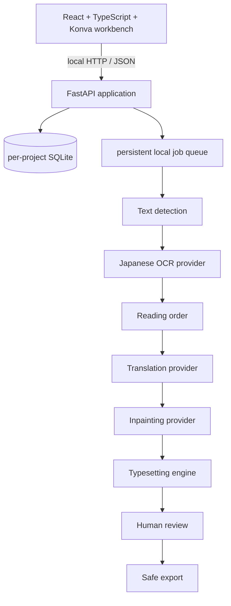

# Manga Localizer

Manga Localizer is a local-first desktop Web workbench for turning Japanese manga screenshots and
scans into reviewed Chinese image exports. It keeps text detection, OCR, reading order, translation,
inpainting, typesetting, review, and export as separate replaceable stages.

> **Release status:** current 0.2.0 MVP. The baseline pipeline is intentionally
> practical rather than magical: Tesseract provides offline Japanese OCR, OpenCV provides basic
> inpainting, and Pillow provides deterministic Chinese typesetting. See [Roadmap](ROADMAP.md) for
> higher-quality models and native packaging.


## What works

- Portable SQLite projects with sanitized JSON snapshots, autosave, reopen, and revision history
- Single, multiple, and nested-folder image import with Unicode paths, cumulative original-path
  protection, and immutable source copies
- Dense three-pane workbench with a zoomable canvas and editable numbered text regions
- Offline Tesseract Japanese detection/OCR, including horizontal and vertical language data
- Manual, deterministic mock, local dictionary, and configurable OpenAI-compatible translation
- Bounded same-page reading-order context, glossary controls, and remote privacy warnings
- OpenCV mask creation/inpainting and Pillow horizontal or vertical Chinese typesetting
- Persistent non-blocking batch jobs with a 1–8 item limit, progress, cooperative controls, failure
  details, and retry; export is serialized for conflict-safe naming
- Safe single/batch export preserving relative folders and emitting original/translated text JSON
- Backend, frontend, and browser-level automated tests using programmatically generated artwork

## Honest limitations

The MVP does **not** provide deep-learning inpainting, a manual mask brush/eraser, arbitrary polygon
regions, JSON-only project import, MangaOCR/PaddleOCR adapters, artistic sound-effect redraw,
automatic font matching, reliable automatic speech-bubble segmentation, book-scale character
reasoning, PDF/EPUB ingestion, native installers, cloud sync, or collaboration. Tesseract accuracy
and OpenCV repair quality vary substantially by scan quality; every rectangular text region remains
editable so the user can correct the baseline. No model weights or fonts are bundled.

## Architecture



Concrete OCR, translation, and inpainting implementations sit behind provider protocols. The UI
never calls a model directly. Project settings are portable; credentials are not.

## Requirements

- Node.js 22.22.2 or newer and npm
- Python 3.12 and [uv](https://docs.astral.sh/uv/)
- Tesseract 5 with Japanese `jpn` and `jpn_vert` language packs
- A current Chromium-based browser is recommended

Apple Silicon and CPU-only systems are supported by the baseline. A GPU is not required.

### Current verification coverage

| Platform | Current coverage |
| --- | --- |
| macOS on Apple Silicon | Primary local development and browser-testing environment |
| Ubuntu | GitHub Actions workflow configured for backend, frontend, and Chromium E2E checks |
| Windows | Startup instructions provided; no Windows CI job yet |
| Chromium | Automated with Playwright |
| Firefox and Safari | Expected to run the Web UI, but not currently covered by automated browser tests |

## Install and start

Clone the repository, then run:

```bash
npm install
npm run setup
npm run dev
```

Open <http://127.0.0.1:5173>. The local API listens on `127.0.0.1:8000`; it is not exposed to the
network by default. Configuration is optional: copy `.env.example` to `.env` before starting if you
want to change ports, runtime storage, OCR, or remote-translation settings. `scripts/dev.mjs` loads
that root `.env` file and passes the values to both development processes. The file is Git-ignored.

### macOS

```bash
brew install node uv tesseract tesseract-lang
npm install
npm run setup
npm run dev
```

### Windows

Install Node.js 22.22.2 or newer, uv, and a current Tesseract build containing Japanese trained data. Ensure
`tesseract.exe` is on `PATH`, then use PowerShell:

```powershell
npm install
npm run setup
npm run dev
```

If Tesseract is elsewhere, set `MANGA_LOCALIZER_TESSERACT_COMMAND` to its full executable path in
your local `.env`.

### Linux (Debian/Ubuntu)

```bash
# Install Node.js 22.22.2+ with its official installer or a version manager first.
sudo apt-get update
sudo apt-get install -y fonts-noto-cjk tesseract-ocr tesseract-ocr-jpn tesseract-ocr-jpn-vert
curl -LsSf https://astral.sh/uv/install.sh | sh
npm install
npm run setup
npm run dev
```

Package names differ between distributions; verify `tesseract --list-langs` contains both `jpn` and
`jpn_vert`. Distribution-provided Node.js packages may be older than this project's requirement.

## First project

1. Start the application and choose **New project**.
2. Enter a project/output folder that is different from the source folder, or leave it blank to use
   the local data directory. Native directory pickers are deferred to desktop packaging.
3. Import images or a folder. Folder import removes the selected root folder itself and preserves all
   paths beneath it, so selecting `input/` retains `chapter-01/001.png`.
4. Run OCR on selected pages, then review numbered regions in the canvas and Text panel.
5. Enter Chinese manually or choose a configured translation provider.
6. Preview inpainting and typesetting. Adjust boxes and typography where the baseline needs help.
7. Confirm or ignore each text region and export. Original files are never replaced.

Default project output resembles:

```text
output/
├── source/chapter-01/001.png
├── generated/
│   ├── inpainted/chapter-01/001.png
│   ├── typeset/chapter-01/001.png
│   └── masks/chapter-01/001.png
├── translated/chapter-01/001.png
├── original-text/chapter-01/001.json
├── translated-text/chapter-01/001.json
├── masks/chapter-01/001.png
└── project/
    ├── project.json
    └── project.sqlite3
```

`source/` is an immutable project-owned copy, never the user's original file. A custom export directory
receives the same reopenable, source-bearing project snapshot; share only `translated/` when recipients
should not receive source artwork. The exported SQLite copy removes machine-only original/project/output
paths, exact import boundaries, and job `outputPath` options, then runs `VACUUM` before publication into
the bundle.

## OCR providers

Tesseract is the default because it starts without Python model downloads and has maintained
cross-platform packages. It performs both region detection and recognition in this MVP. Install
Japanese horizontal and vertical data and check provider health in Project Settings.

MangaOCR and PaddleOCR are planned roadmap adapters, not implementations included in this release.
Their larger dependencies and model downloads are deliberately excluded from the default install so
they cannot stop the editor from starting. See [Provider system](docs/provider-system.md).

## Translation providers

- **Manual:** performs no automatic translation and preserves user input.
- **Mock:** deterministic output for tests and demonstrations.
- **Dictionary:** applies a local exact-match glossary without a language model.
- **OpenAI-compatible:** uses a configurable base URL, model, and process/session API key.

Copy `.env.example` to `.env` for process configuration, or enter an API key in Project Settings for
the current backend session only. Never paste a production credential into a project manifest. Each
remote request contains the current text, a bounded number of preceding/following text regions by
reading order on the same page, optional character names/glossary, and no image bytes or whole-book
context.

Use HTTPS for every non-loopback endpoint. Plain HTTP is appropriate only for a trusted service bound
to loopback, because the configured API key is sent to that endpoint as a Bearer credential. Endpoint
validation rejects embedded credentials, query strings, fragments, and non-loopback HTTP. Changing the
remote endpoint or model invalidates translation, typesetting, and export results so stale output cannot
be treated as current.

## Privacy and source safety

Everything is local by default. Images are not uploaded by the application. Only selecting and
configuring a remote translation provider enables outbound text requests, and the UI displays this
risk before use. API keys are redacted and excluded from SQLite, project JSON, and logs. Imports are
treated as read-only; every export target is checked against recorded originals, and edits invalidate
stale rendered output before preview/export. Export paths are validated and conflict-safe. Read [Privacy](docs/privacy.md)
and [Security](SECURITY.md) before enabling remote services.

## Reliability and recovery

- Trusted local selections are recorded cumulatively as exact file/directory `ImportBoundary` rows
  before image decoding. A candidate that later fails validation remains protected from export writes.
  `inputRoot` is only a convenience summary and can be empty when selections have no usable common path,
  including cross-drive Windows imports.
- Portable path conflicts use component-wise Unicode NFKC plus case-folded comparison. Imports and
  exports therefore rename or reject names that would collide on a case-insensitive or
  normalization-insensitive filesystem.
- Project and region writes carry revision guards. Autosave rebases newer local edits and project
  settings onto acknowledged server revisions; an unresolved concurrent conflict is surfaced instead of
  silently overwriting another edit.
- Pause/cancel is cooperative: active items may finish, queued items stop, and persisted running work is
  recovered after restart. An interrupted cancelled item remains cancelled and can be retried explicitly.
- Export files and the portable manifest/database pair use atomic replacement. A job-scoped owner marker
  permits recovery of only that job's partial bundle, including SQLite temporary sidecars. An export job
  remains nonterminal until bundle finalization succeeds.
- A relative custom export path is resolved and persisted against the project root before work starts,
  not against a later process working directory.

## Development and tests

```bash
npm run dev                 # API + Vite with reload
npm run check               # launcher + backend + frontend gates
npm run test:e2e            # full browser flow
npm run audit:release       # secrets, personal paths, weights, fonts, DBs, large files
```

Run `npm run setup:test` once before the first Playwright run. Backend-only and frontend-only
commands are documented in [Development](docs/development.md).

The 0.2.0 source tree was verified on 2026-08-06:

- `npm run check`: 2 launcher tests, Ruff lint/format plus 78 backend pytest cases, and ESLint,
  TypeScript, 39 frontend Vitest cases, and the production Vite build
- Playwright: 2 Chromium scenarios, including the real local Tesseract workflow
- Dependency audits: 0 known vulnerabilities in both npm dependency trees and from
  `pip-audit`
- Release audit: 94 candidate files plus Git history scanned with 0 findings
- `npm run dev`: root page, direct API health, and the Vite `/api` proxy were exercised successfully

## Repository layout

```text
backend/        FastAPI application, providers, storage, workers, and pytest suite
frontend/       React workbench and Vitest suite
tests/e2e/      Playwright user journeys
scripts/        fixture generation and release audit
docs/           architecture, model, provider, privacy, and contributor documentation
.github/        CI, issue forms, and pull-request template
```

## FAQ

### Does OCR also translate?

No. Detection, OCR, reading order, and translation are explicit separate stages.

### Why is the repaired background imperfect?

The default OpenCV algorithm interpolates nearby pixels; it does not understand line art. Adjust the
text box and its mask padding/dilation, preserve the source region, or use an external editor for
difficult textures. The MVP has no manual mask brush.

### Can I use a commercial font?

Configure a font you are licensed to use. This repository does not ship fonts.

### Where are my projects?

The output root you chose contains the portable database and JSON manifest. If you leave it blank,
projects are created below `MANGA_LOCALIZER_DATA_DIR/projects/`; that data directory defaults to
`~/.manga-localizer`. Copying `.env.example` intentionally overrides it with the repository-relative
`.manga-localizer` directory unless you edit that value. A local catalog there remembers recent project
manifests. The JSON snapshot is inspectable, but reopening still requires the adjacent SQLite database.

### The OCR health check fails

Run `tesseract --version` and `tesseract --list-langs`, confirm `jpn` is present, and see
[Troubleshooting](docs/troubleshooting.md).

## Contributing

Issues and pull requests are welcome. Start with [CONTRIBUTING.md](CONTRIBUTING.md), follow the
[Code of Conduct](CODE_OF_CONDUCT.md), and avoid attaching copyrighted manga pages to public issues.
The project is licensed under [Apache-2.0](LICENSE). Dependency licensing is summarized in
[Third-party notices](THIRD_PARTY_NOTICES.md).
