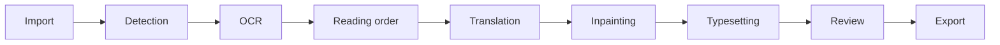

# ADR 0001: Local-first modular workbench

- Status: accepted
- Date: 2026-08-06

## Context

Manga localization is a pipeline, not a single OCR or chat request. The product must remain usable
offline, keep source files immutable, survive interruption, preserve nested Unicode paths, and allow
individual ML or service components to be replaced without rewriting product logic.

## Decision

Use a browser-based React editor backed by a local FastAPI process. Keep the eight stages explicit:

Provider protocols isolate OCR, translation, and inpainting. A separate typesetting engine owns
layout and high-resolution rendering. FastAPI routes call application services rather than concrete
providers. SQLite is the source of truth; a sanitized JSON snapshot supports inspection and portability
checks, but opening a project still requires the adjacent SQLite database.

The first working OCR provider uses the locally installed Tesseract executable with Japanese
horizontal and vertical language packs. This is lightweight and cross-platform enough for a safe
default. Higher-quality MangaOCR and PaddleOCR adapters are planned rather than included because their
downloads and runtime footprint must never prevent application startup.

OpenCV Telea inpainting is the baseline eraser. Pillow renders horizontal or vertical Chinese text,
with system-font discovery and user font configuration. Both are intentionally replaceable.

An in-process persistent queue stores jobs and item progress in SQLite. One job runner avoids requiring
Redis or a daemon for the MVP, resumes interrupted work on startup, and keeps processing off request
handlers. Detection, OCR, translation, and rendering can process one to eight items concurrently under
the user's limit; export is serialized for conflict safety. Pause/cancel controls are cooperative
between item batches rather than hard interrupts.
A future desktop shell can supervise the same API without changing project data.

## Consequences

- The MVP runs fully locally after installing system Tesseract and project dependencies.
- Browser folder imports use `webkitRelativePath`, strip the selected root folder, and retain its nested
  tree; server-path import is also available for trusted local use. Native folder dialogs are deferred
  to a Tauri/Electron shell.
- OpenCV inpainting and Tesseract detection are practical baselines, not promises of production-grade
  artistic reconstruction or perfect bubble segmentation.
- Persisted regions are rotatable rectangles. JSON-only project import, arbitrary polygons, and manual
  mask painting are deferred.
- Provider settings are portable, while credentials remain session/environment scoped.
- SQLite writes, generated files, and export paths require transaction and traversal checks.

## Rejected alternatives

- A single model endpoint: conflates detection, OCR, translation, and image editing.
- Electron/Tauri first: adds packaging work before the useful editing loop exists.
- Redis/Celery: increases installation burden for a single-user local application.
- Shipping model weights or fonts: creates repository size, licensing, and privacy risks.
